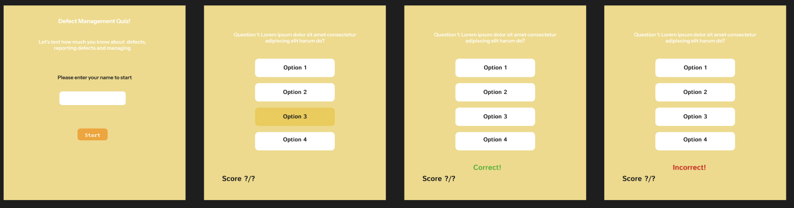
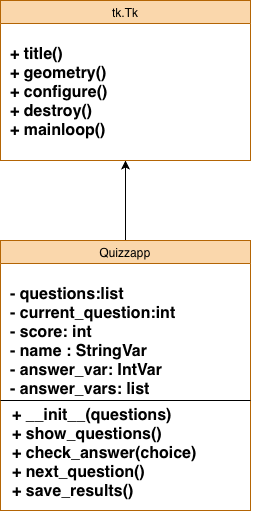
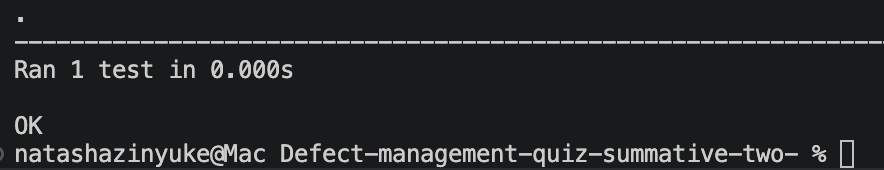
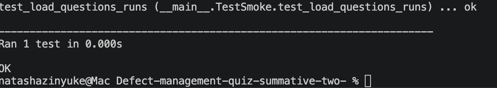
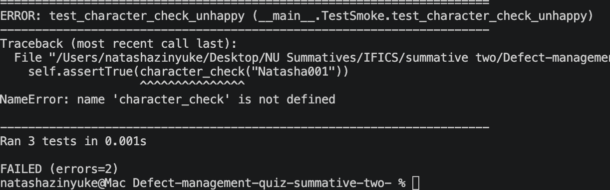

# Defect-management-quiz
this is my summative two code for IFCP course, year one

## Order of Documentation
1. Introduction
2. Design
3. Development
4. Testing
5. User Documentation
6. Evaluation 

# Introduction
As new websites, apps and software system are becoming increasingly important to business operations so does the quality. It is important that these applications are efficient, reliable and provide great customer sattisfaction. 

The Software Development Life Cycle (SDLC) includes the important part of testing and defect managemnmet plays a key role in that. As you perform functional testing, regression testing, unit testing, system testing and User Acceptance Testing (UAT) bugs and defects are going to found. Defect managemnet can ensure that these bugs/defects are identified correctly, tracked and auditted properly, prioritised during testing. Making sure that the relevant employees have a strong understanding and knowledge around this proccess can help reduce failures, improve quality of software and have effective collaboration for the resolution

This project is a simple multiple choice quiz using python(https://www.python.org) and Tkinter (). The purpose of this quiz application is to test the user on their knowledge on defect Management and to provide training. Five qustions multiple choice questions are displayed one at a time allow the user to select one option out of four.

# Design 
## Figma Design
This is the initial design for the quiz. The user would be greeted with a welecome screen in which they enter name. Then one question will show up at a time display the question at the top and the four option buttons beneath. Once the user clicked an option the feedback will be shown either "Correct" or "Incorrect" and move onto the next question. Each time the score would be calculated and show in the left-bottom corner. Initially I had designe the user journey to only be a few simple steps:
1. Open app
2. Enter name and submit
3. Click your choice
4. Repeat step 3 until end of quiz



I have slighly changed from the initial design and instead the user is allowed to change go to the next question on their own accord. I decided this so that the user can then review the question and try understand as to why the may have gotten it wrong instead of immediately switch to the next question and not having any time memorise or learn. 


## Functional Requirements
1. Load questions from a CSV file
2. Display GUI
3. Allow the user to select their choice
4. Feedback is shown 
5. The score is tracked and shown at the bottom of the page
6. When Next button is clicked the next question is displayed
7. save the results to a csv file

## Non-Functional Requirements
1. Easy to use UI
2. Fast response time 
3. Maintainable code
4. Readable code

## Tech Stack

List of programming languages amnd libaries used.

| Technology | Purpose |
|------------|---------|
|Python| Programming Language used to code app|
|Tkinter| GUI, used to create Graphical User. Interface|
|CSV|Used to load data from and and input data into|
|unitest|Used to perform automated test|

## Class Diagram


# Developnment

## Project Structure
 Defect-Management--uiz-summative-two
 |
 |-main.py
 |-question.csv
 |-quiz_data.py
 |-results.csv

## Loading questions
 The questions are stored in a CSV file which is pulled and loaded into python using a function called load_questions.
 CSV structure: questions,option1,option2,option3,option4,answer```
 
 In quiz_data.py the function "load_questions" the csv file "question.csv" will be loaded and an empty questions list is created.

 ```python
 def load_questions(filepath='question.csv'): #creating function to load questions from csv file
    questions = [] #empty list to store questions
 ```
  Using a for loop it will loop through each row in the CSV file and add it into the empty list and convert each question into a dictionary with the four ooptions. The answer values in the CSV file are represented as an integer so that pyton can read it by its index. 

  ```python
   for row in reader: #will loop for each row in questions.csv file
            questions.append({ #adding to the empty list
                "questions":row["questions"],
                "options":[
                    row["option1"],
                    row["option2"],
                    row["option3"],
                    row["option4"],
                ],
                "answer":int(row["answer"])-1 #index is always 0 so -1
            })
    return questions
```


# Testing

## Manual testing
|Test|Test Data|Expected Result|Actual Result|Status|
|----|---------|---------------|-------------|------|
|Launch app|Run main.py file|GUI window opens successfully|works as expected|Pass|
|Enter valid name|"Natasha"|Name accepted and saved into csv file once quiz is completed|Works as expected|Pass|
|Enter invalid naem|123|Name not accepted and error message pops up|


## automation testing

First I checked that my unit testing framwork was working by assert the value 1 to true which is correct.
```python
import unittest
from quiz_data import load_questions

class TestSmoke(unittest.TestCase):

    def test_load_questions_runs(self):
        self.assertTrue(1)

if __name__=="__main__":
    unittest.main(verbosity=1)
``` 

then I add a function that will check that the questions are successfully loading from csv file.
```python
def test_load_questions_runs(self):
    questions=load_questions()
    self.assertIsNotNone(questions)
```


then I add character_check functions that will check if the validation of names is correct. This will not work since there is no validation in the main.py file so we should recieve an error

```python
 def test_character_check_happy(self):
        self.assertTrue(character_check("Natasha"))
        self.assertTrue(character_check("Natasha Zinyuke"))

def test_character_check_unhappy(self):
    self.assertTrue(character_check("Natasha001"))
    self.assertTrue(character_check("#Natashaisthenumber1best"))
```


# Documentatuon

## User Documentation
#### Step 1: Lanuch the application
#### Step 2: Enter your name
#### Step 3: Read questions carefully and click your chosen answer
#### Step 4: Once feedback is recieved click next to move onto the next question
#### Step: Repeat steps 3 and 4 until quiz is complete

## Technical Documentation

```bash
git clone https://github.com/NUnatasha/Defect-management-quiz-summative-two-/blob/main/README.md
```

# Evalution
- add date and time to show date of when user takes quiz
- adding more complex quix 
- adding levels depending on users confidence
- leaderboard to encourage people to take the quiz
